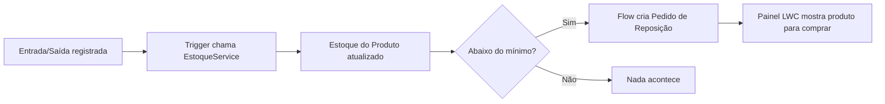

# 📦 Controle de Estoque e Reposição — Portfólio Salesforce

> Solução Salesforce end-to-end para gestão de estoque: automação Apex, Flow e Lightning
> Web Components trabalhando juntos para eliminar ruptura de estoque e reposição manual.

**Repositório:** https://github.com/Rafaelaale/salesforce-studies/tree/main/projetos/controle-estoque-salesforce

**Stack:** Apex · Lightning Web Components · Flow · SOQL · Salesforce CLI · Testes Unitários

## 🎯 O Problema Que Este Projeto Resolve

Empresas perdem venda e cliente quando um produto acaba sem aviso. Este projeto automatiza
todo o ciclo: **registra a movimentação → recalcula o estoque → detecta ruptura → dispara
reposição automática → mostra tudo em um painel**, sem intervenção manual.

## 💡 Destaques Técnicos

- **Automação orientada a evento**: 3 triggers (`Entrada`, `Saída`, `Produto`) mantêm o
  estoque sempre consistente, inclusive revertendo corretamente valores quando um registro
  é excluído — um detalhe que a maioria das implementações ignora.
- **Baixo acoplamento**: toda a regra de negócio vive em uma service layer (`EstoqueService`),
  não nos triggers — fácil de testar e de estender.
- **Automação declarativa integrada ao Apex**: Flow autolançado é invocado via
  `Flow.Interview`, unindo o melhor dos dois mundos (declarativo + código).
- **Cobertura de testes real**: cenários de inserção, atualização *e* exclusão, incluindo
  reversão de estoque — não só o "caminho feliz".
- **UI pronta para o usuário final**: painel Lightning (`painelProdutosParaComprar`) lista
  em tempo real o que precisa ser comprado, com dados vindos de um controller
  `@AuraEnabled(cacheable=true)`.
- **Segurança de acesso**: Permission Set dedicado, sem depender de perfis genéricos.

## 🧱 Modelo de Dados

| Objeto | Papel |
|---|---|
| `Produto__c` | Estoque atual, estoque mínimo e fornecedor |
| `Entrada__c` | Movimentação que **aumenta** o estoque |
| `Saida__c` | Movimentação que **diminui** o estoque |
| `Fornecedor__c` | Quem fornece cada produto |
| `Pedido_Reposicao__c` | Criado **automaticamente** quando o estoque fica baixo |

## ⚙️ Como Funciona (Fluxo Completo)



## 📂 Conteúdo do Repositório

### Classes Apex

- **EstoqueService** — aumenta, diminui, reverte e verifica o estoque mínimo dos produtos.
- **ProdutosParaComprarController** — fornece dados para o painel LWC.
- **EstoqueServiceTest** e **ProdutosParaComprarControllerTest** — testes unitários.

### Automação

- **EntradaTrigger** / **SaidaTrigger_Estoque** / **ProdutoTrigger** — disparam a lógica de
  estoque a cada inserção, atualização e exclusão.
- **EstoqueBaixo_CriarPedidoReposicao** — Flow autolançado que cria o Pedido de Reposição.

### Lightning Web Components

- **painelProdutosParaComprar** — painel com os produtos abaixo do estoque mínimo.

### Permission Set

- **AcessoControleEstoque** — permissões de leitura e edição dos objetos e campos do módulo.

## 🗂️ Estrutura Principal

```text
force-app/main/default/
	classes/
		EstoqueService.cls
		EstoqueServiceTest.cls
		ProdutosParaComprarController.cls
		ProdutosParaComprarControllerTest.cls
	flows/
		EstoqueBaixo_CriarPedidoReposicao.flow-meta.xml
	lwc/painelProdutosParaComprar/
		painelProdutosParaComprar.html
		painelProdutosParaComprar.js
	objects/
		Produto__c/
		Entrada__c/
		Saida__c/
		Fornecedor__c/
		Pedido_Reposicao__c/
	permissionsets/
		AcessoControleEstoque.permissionset-meta.xml
	triggers/
		EntradaTrigger.trigger
		SaidaTrigger_Estoque.trigger
		ProdutoTrigger.trigger
```

## 🚀 Como Rodar

1. Instale o Salesforce CLI e o Node.js.
2. Instale as dependências do projeto:

	```bash
	npm install
	```

3. Autentique-se em uma org Salesforce:

	```bash
	sf org login web -a academia
	```

4. Implante os metadados:

	```bash
	sf project deploy start --source-dir force-app/main/default --target-org academia
	```

5. Execute os testes Apex:

	```bash
	sf apex run test --target-org academia --test-level RunLocalTests --wait 10
	```

6. Execute as validações locais do LWC:

	```bash
	npm run lint
	npm test
	```

## 📐 Regras De Negócio Implementadas

Um produto está abaixo do mínimo quando `Quantidade_Em_Estoque__c < Quantidade_Minima__c`.
Ao excluir uma Entrada ou Saída, o estoque do produto é revertido para o valor anterior à
movimentação excluída. A criação/atualização de estoque dispara automaticamente a
verificação de mínimo e, se necessário, o Flow de reposição.

## 📬 Contato

- **Rafael Alexandre Oliveira Araújo**
- **LinkedIn:** https://www.linkedin.com/in/rafael-araujo-aa10a423/
- **Email:** Rafex113@gmail.com


